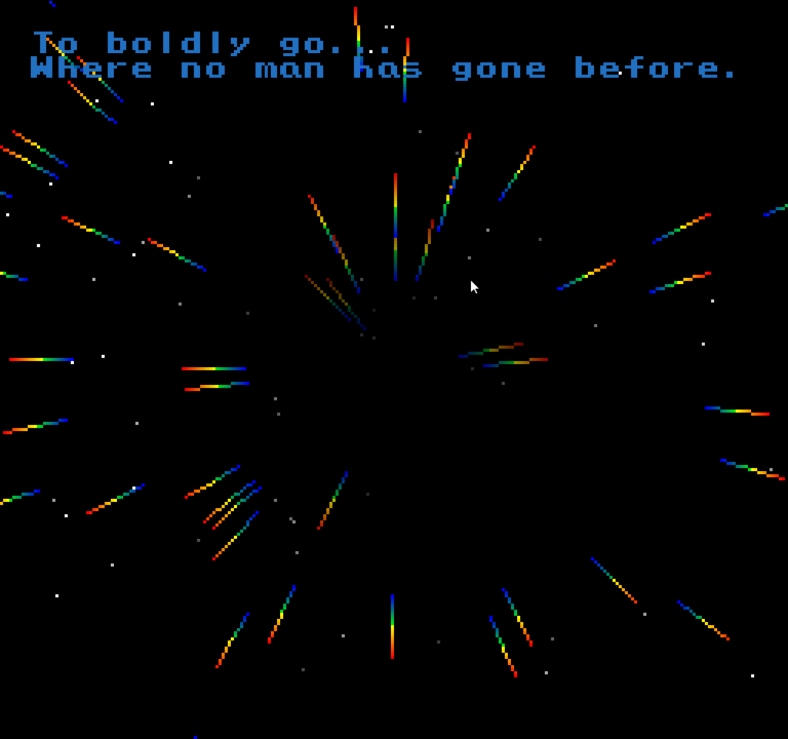
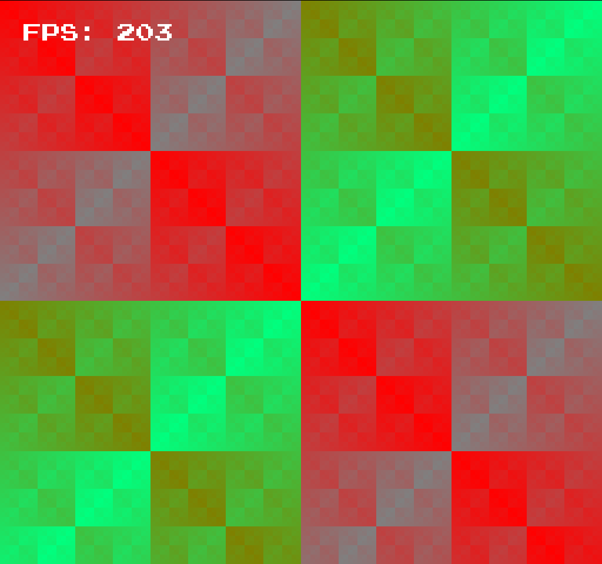

# olcPixelGameEngine graphical demos & concepts

A set of examples and graphical demos/concepts showing how to use the olcPixelGameEngine (https://github.com/OneLoneCoder/olcPixelGameEngine) aka PGE:

 * **doom_fire_effect.cpp:** a famous fire effect used in Playstation's version of Doom;

 * **startrek_warp.cpp:** a simulation of the Star Trek Next Generation warp effect;

 * **xor_texture.cpp:** a XOR texture generator.

 * **tunnel.cpp:** an old school Tunnel Effect.

